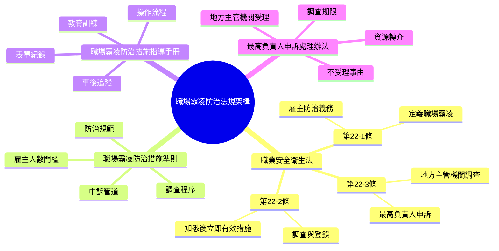
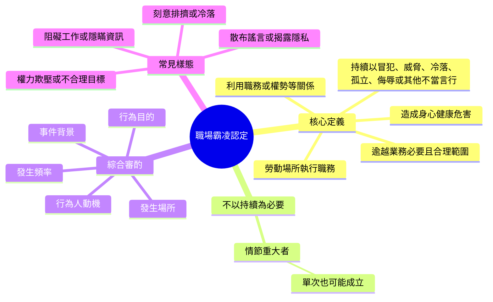
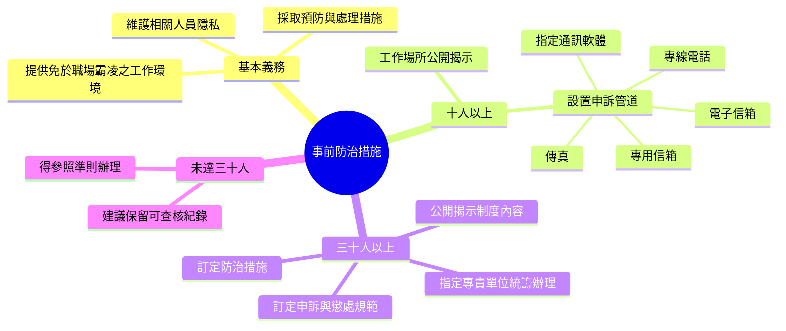
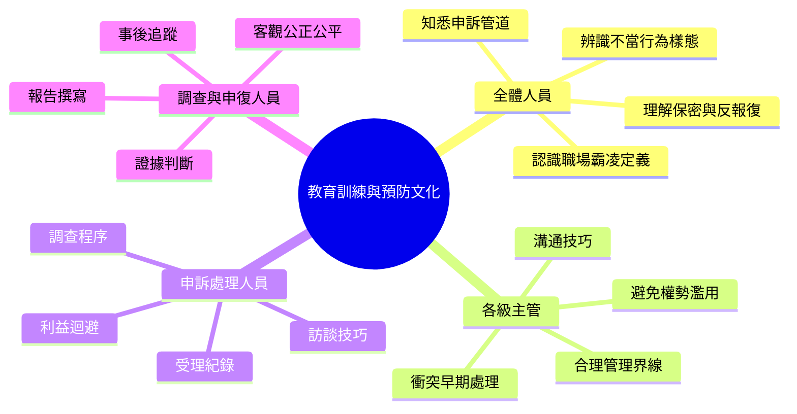
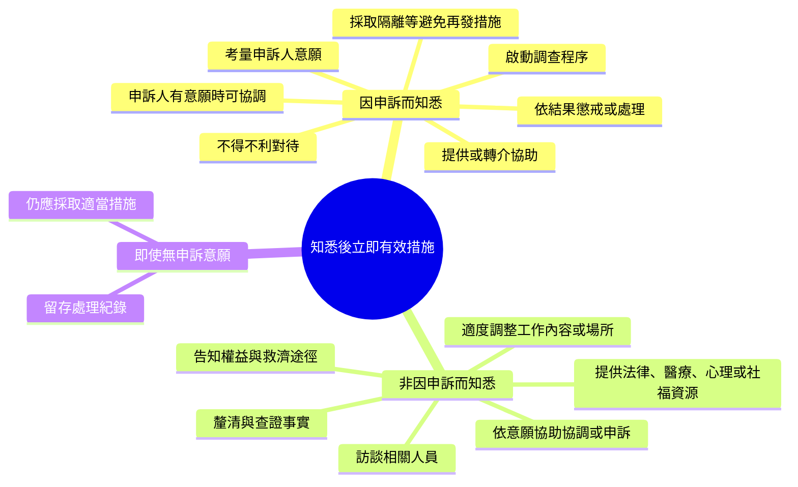
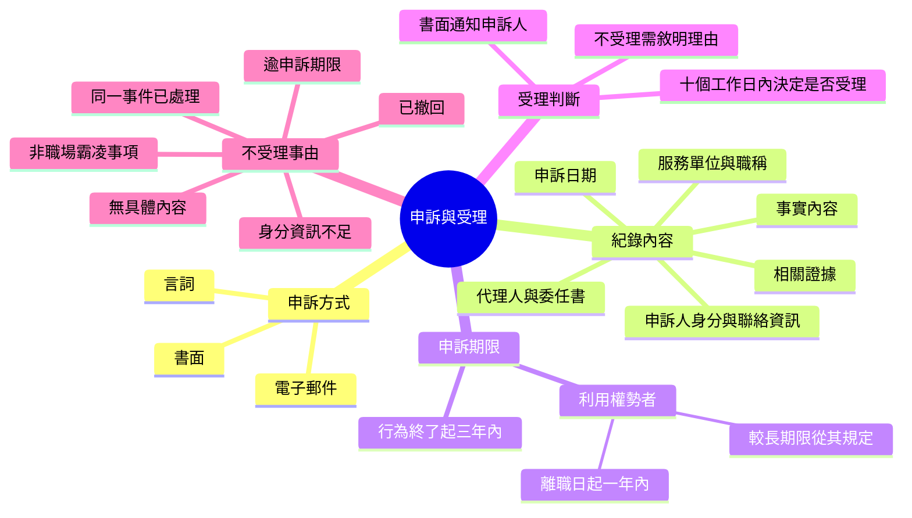
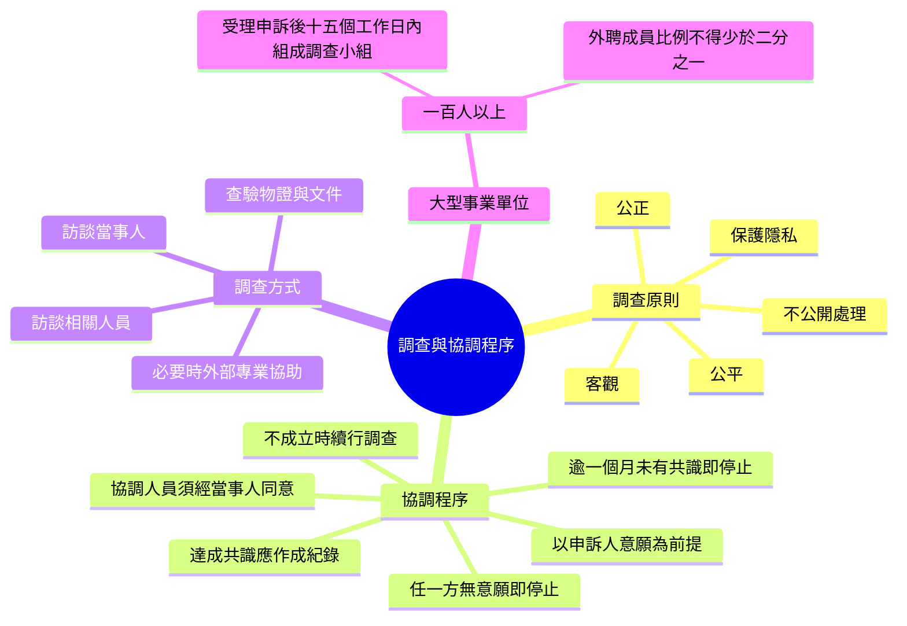
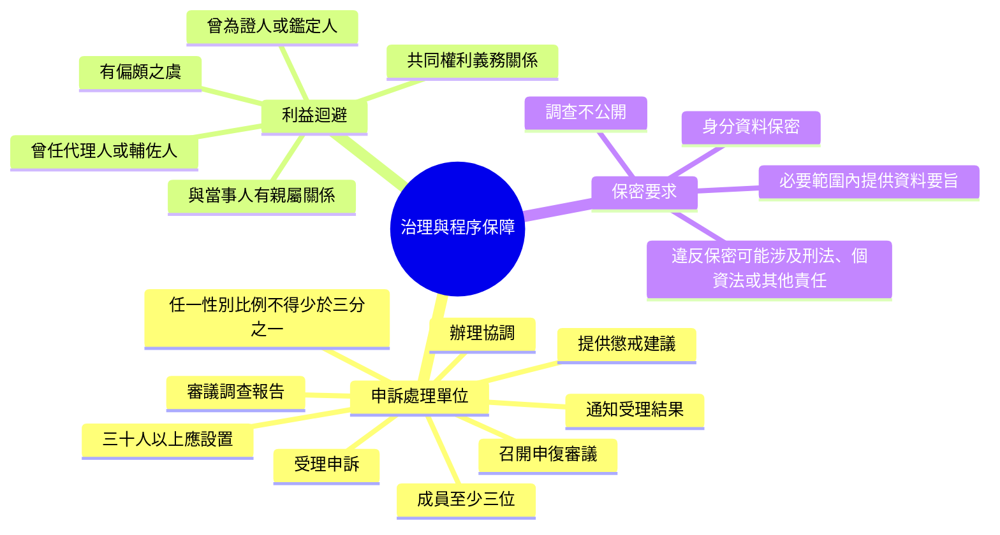
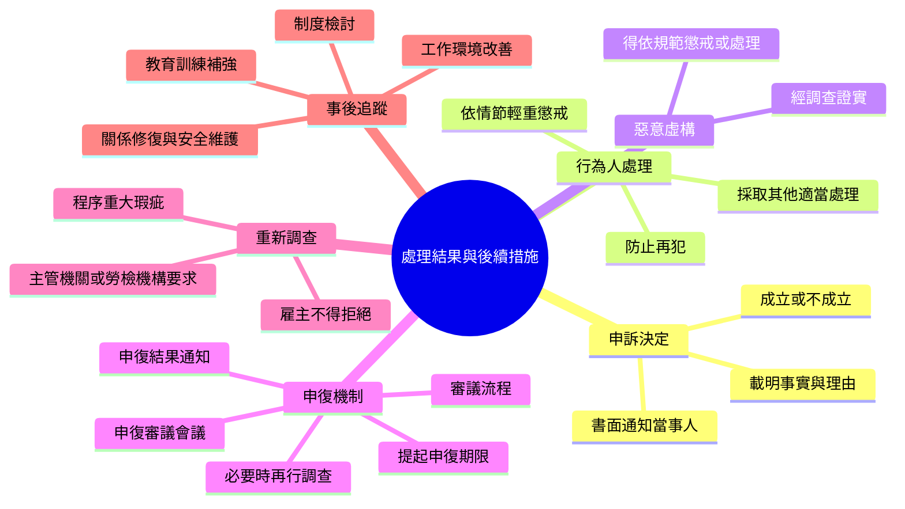
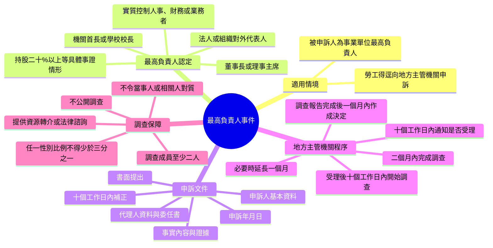

# 職場霸凌防治法規心智圖

> 依 `laws/` 內四份資料整理：職業安全衛生法職場霸凌防治專章、職場霸凌防治措施準則、職場霸凌防治措施指導手冊、地方主管機關受理最高負責人職場霸凌事件申訴處理辦法。以下內容供教育訓練、內部制度設計與查核討論使用。

## 1. 法規架構與角色分工

## 2. 職場霸凌定義與認定原則

## 3. 雇主事前防治義務

## 4. 教育訓練與組織預防

## 5. 知悉事件後的立即有效措施

## 6. 申訴提出、紀錄與受理判斷

## 7. 調查、協調與證據處理

## 8. 申訴處理單位、利益迴避與保密

## 9. 申復、懲戒與事後改善

## 10. 最高負責人職場霸凌事件外部申訴

